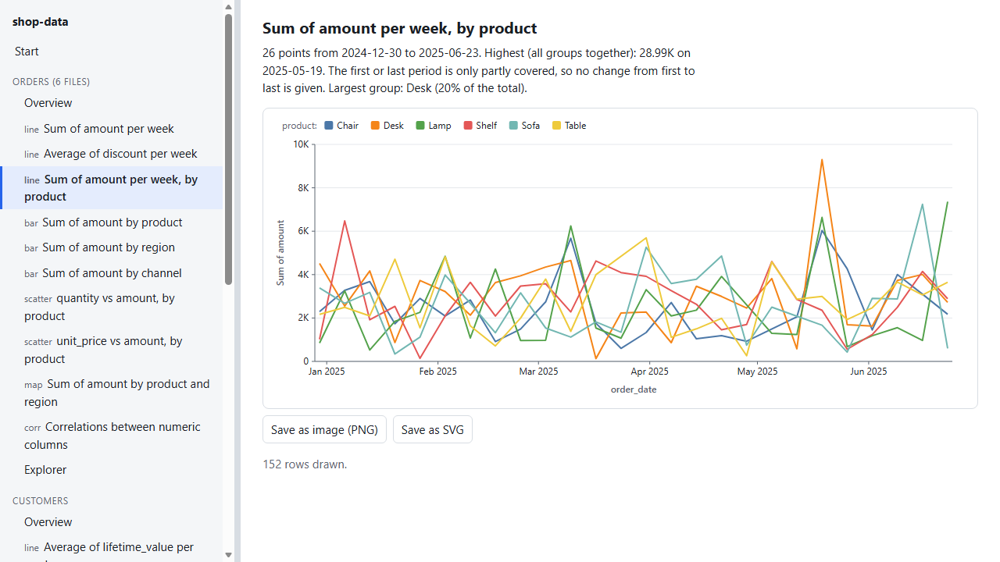

# Local Data Viz

Point it at a folder of data files and get a folder with a web page of charts: a menu on the left (with a bar you can drag to
change its width), the charts on the right, and an explorer where you group and split the numbers yourself. Everything is made on
your computer. Claude decides what is worth charting; [DuckDB](https://duckdb.org) does the maths; nothing is uploaded.

You say "make charts from the data in this folder" (or use `/local-data-viz:charts <folder>`). Claude looks at what the files
contain, writes a short plan (which numbers to add up or average, by what, over which dates), builds the page, and gives you a
`file:///` link. The page opens straight from disk: double-click it, no server, no internet.

- **Requirements:** Claude Code, Node 18 or newer, and the DuckDB command-line tool 1.0 or newer. DuckDB is the one thing to
  install (see Setup). A web browser to look at the result.
- **Costs:** nothing beyond your normal Claude usage. No accounts, no keys, no services.

## Setup

1. Install the plugin: `/plugin marketplace add ultrathinker/local-data-viz`, then install **Local Data Viz** from it.
2. Install DuckDB once (the plugin never downloads or installs anything itself):
   - Windows: `winget install DuckDB.cli`
   - macOS: `brew install duckdb`
   - Linux: download `duckdb_cli-linux-amd64.zip` from <https://github.com/duckdb/duckdb/releases/latest>, unzip it and put
     `duckdb` on your `PATH`.
   - Or set `LOCAL_DATA_VIZ_DUCKDB` to the full path of the program. Open a new terminal afterwards so the `PATH` is refreshed.
3. Check: `node scripts/viz.mjs doctor` (Claude runs the same check first and tells you what is missing).

## What it reads

A folder, and the folders inside it (up to 8 levels, 400 files). Not a URL, not a database, not a single file.

| Format | Notes |
| --- | --- |
| `.csv` `.tsv` `.tab` | delimiter, header, quotes and types are detected by DuckDB; a file it cannot parse is retried leniently, then skipped with the reason; header lines repeated in the middle of a file are removed from a copy (the original is untouched) and reported |
| `.json` `.jsonl` `.ndjson` | an array of objects or one object per line; one level of nested objects becomes columns named like `user.country` that can be charted; arrays and deeper objects are listed but not charted |
| `.xlsx` | every visible sheet is one table; the first non-empty row is the header (a title row above it, with a single filled cell, is skipped and reported); dates are found by their number format; formulas show the value Excel last saved. Up to 80 MB and 2,000,000 rows per sheet |
| `.parquet` | read by DuckDB as is |

Files with the same set of columns (a month per file, a region per file) are read together as ONE dataset. Other files are
ignored and listed. Hidden folders, links, `node_modules` and the plugin's own `*-viz` output folders are skipped.

## What you get

A new folder next to the one you named: `<folder>-viz/run-<time>/`, with `index.html`, `assets/` (the page code), `data/` (the numbers behind each chart, already summed up), `plan.json` and a short `README.txt`. Each build makes a new
`run-<time>` folder; nothing that exists is ever replaced.

- **Charts:** lines over time (with a split by category), bars (top N, stacked by a second category), histograms, scatter
  plots, heatmaps and a correlation matrix, each with one plain sentence about what it shows. The page draws them itself as SVG (no chart library) and
  saves any of them as an SVG file or a PNG picture.
- **Overview** of each dataset: row and column counts, key totals, date range, every column with its kind, missing values and
  common values, and notes about quality (empty columns, columns that hold the same value everywhere).
- **Explorer:** for up to five columns (categories or dates) and a few measures, DuckDB pre-computes the grand total, every
  grouping by one column and every grouping by two. The page then lets you pick a measure, a grouping and an optional split and
  redraws instantly; the table underneath downloads as CSV.
- **The plan** (`plan.json`) is plain JSON: edit it and build again to change the page. See `docs/PLAN-FORMAT.md`.

## How it works

`viz.mjs inspect` scans the folder, converts Excel sheets to CSV in a work folder, asks DuckDB to describe and summarise every
dataset, decides what each column is for (a number to measure, a category to split by, a date, an identifier, free text), and
prints a report with a draft plan. Claude reads it, edits the plan and runs `viz.mjs build`. Every chart is one SQL query run by
DuckDB in memory, so a 100,000-row file becomes a page of small summaries. The data fields in every chart are fixed names; your
column names only ever appear as text.

## Privacy and safety

- **Nothing leaves your computer.** The plugin makes no network request: DuckDB runs in memory with automatic extension
  downloads switched off, and the page has a strict content policy (`connect-src 'none'`, no inline scripts).
- **Claude sees what the script prints**: column names, ranges, averages, the most common values of category columns and the
  strongest correlations. If the data is confidential, ask for `--no-values`: the report then shows structure only (names, types,
  kinds and counts), and Claude is told not to open the page files. The page itself still shows your numbers: it is for you.
- **The page holds summaries, not your rows**, with one exception: a scatter plot draws a fixed sample of up to 2,000 points
  (two numeric columns, plus one category). Check the page before you share it: it also shows your file and column names.
- **Nothing is deleted, moved or overwritten.** The data folder is only read. Links are never followed. Work files and pages go
  next to the data folder, in new files.
- See `PRIVACY.md` and `SECURITY.md`.

## Limits and known caveats

- JSON text must be UTF-8. CSV may be UTF-8 or UTF-16 (a UTF-8 copy is made in the work folder and read; the original is untouched). A file saved in an old Windows code page is skipped, with the reason.
  Numbers with a decimal comma (`1234,56`, as in many European exports) are read as numbers; thousands separators, currency signs
  and percent signs are not understood, so such columns stay text.
- Dates are recognised when DuckDB reads them as dates or when almost every value of a text column parses as an ISO-style date
  or timestamp (a time zone offset is ignored). Other formats (such as `25/12/2024`) stay text.
- Filters keep rows by a column's value, a list, a range, a text or the last months of the data; they are written in the plan, one
  list per page, chart or explorer, and combine with AND. There is no OR between filters, no filter on a computed value, and no
  joining of datasets. The explorer offers single columns and pairs only. A grouping with more than 5,000 cells is not offered.
- The correlation matrix and scatter plot show linear (Pearson) relationships only. Correlation is not causation.
- `.xls` (old Excel), ZIP64 `.xlsx` workbooks, password-protected files, and links to online data are not read.
- The page is written for a current Chromium-based browser (it is tested in one). Firefox and Safari should work but are not tested.
- English only.

## Verified by running

On Windows 11 with Node 24 and DuckDB 1.5.6 the whole test suite passes (`node --test tests/*.test.mjs`): the numbers on the
charts match totals computed in plain JavaScript from the same CSV files, a build twice from the same data is byte-identical, hostile
file and column names (quotes, line breaks, `.shell` lines, HTML) execute nothing, the page loads with no error and no
non-local request in headless Edge, the splitter works by mouse and keyboard, and a 100,000-row file builds in seconds. The CI
workflow (`.github/workflows/ci.yml`) is set up to run the same suite on Linux, Windows and macOS with Node 18 to 24.

## Development

    node --test tests/*.test.mjs

needs DuckDB on the `PATH` (tests that need it are skipped, with a note, when it is missing). The page tests also need Chrome or
Edge and a Node with a global `WebSocket` (22 or newer); they are skipped otherwise. The tests use synthetic data only and never
touch the network. See `CONTRIBUTING.md`.

## License

MIT. No third-party code is bundled.
